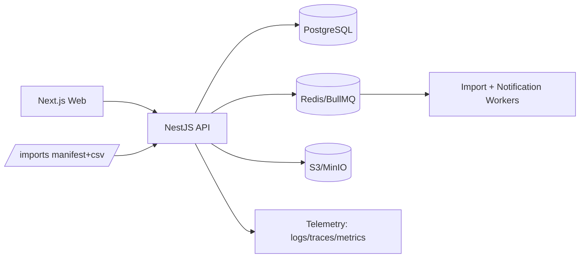
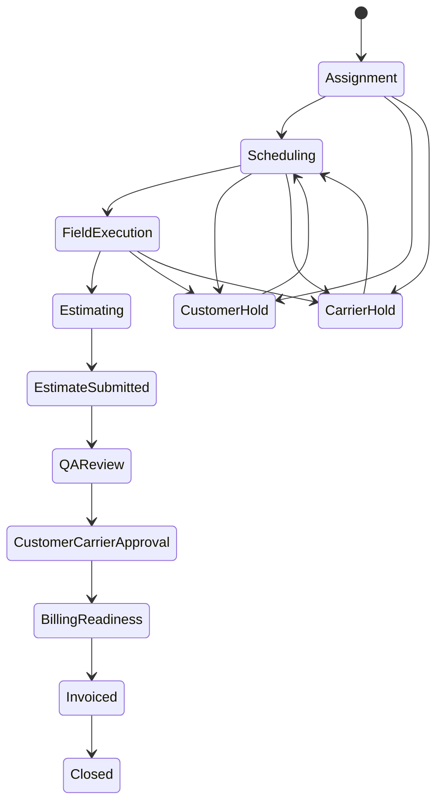

# ADR-0001: BEAST CRM Architecture (Phase 1)

## Status
Accepted

## Context
We need a secure, auditable, scalable CRM for restoration operations with robust CSV ingestion and workflow gating.

## Decisions
1. **Monorepo** with apps/api (NestJS), apps/web (Next.js), packages/shared.
2. **Data store** PostgreSQL + Prisma; all timestamps UTC.
3. **Background processing** BullMQ + Redis for imports, notifications, and async tasks.
4. **Object storage** S3-compatible abstraction (MinIO local).
5. **AuthN/AuthZ** JWT access+refresh with RBAC matrix scoped by organization/branch.
6. **Auditability** immutable audit log on all mutations.
7. **Workflow** finite-state machine for `Job.status` with guard checks.
8. **CSV ingestion** batch-manifest driven, idempotent upsert by `(organization_id, external_id)`, dry-run support, rejects output.
9. **Feature flags** DB-backed with allowlist and percentage rollout.

## Module boundaries
- **Domain**: entities, workflow policies, validation rules.
- **Application**: use-cases, orchestration, DTOs, commands.
- **Infrastructure**: Prisma repositories, queue workers, storage adapters.
- **Interface**: REST controllers and OpenAPI.

## High-level architecture

## Job FSM (default)

## Security controls
- Row-level scoping by organization/branch in query layer.
- Password hashing with Argon2.
- PII-safe structured logs.
- Refresh token rotation support.
- Audit records capture actor, action, before/after snippets.

## Tradeoffs
- Prisma chosen for velocity and typed queries; less flexibility than hand-written SQL in edge cases.
- Postgres FTS/trigram keeps complexity low versus early Elasticsearch adoption.
- JWT local auth now, OIDC-ready extension later.
